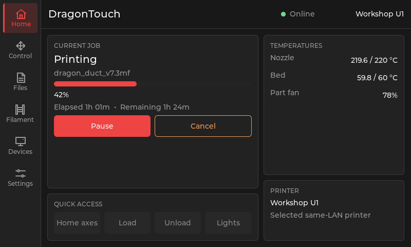

# DragonTouch physical UI

DragonTouch uses a native LVGL interface sized first for the 800×480 K-Touch and
PandaTouch panel. It carries the existing Dragon-family design language rather than
copying an OEM screen: charcoal background, quiet bordered cards, compact labels,
an icon/label rail, strong hierarchy, and a single red product accent.

The primary rail uses code-drawn, two-pixel outline icons that echo the Lucide-derived
Dragon WebUI sprite: house and slider-settings shapes are family-aligned, while motion,
file, spool, and display symbols make the printer-specific destinations unambiguous.

## Design tokens

| Role | Value |
|---|---|
| Background | `#181818` |
| Surface | `#222222` |
| Raised/control surface | `#303030` |
| Border | `#3A3A3A` |
| Text | `#F5F5F5` |
| Muted text | `#999999` |
| DragonTouch accent | `#EF4444` |
| Healthy | `#74D58B` |
| Warning | `#F59A56` |

Red identifies selection, progress, and primary actions. It must not be the only
fault signal: faults require explicit text and, where useful, an icon. Destructive
actions must use confirmation and must not be visually confused with routine primary
actions even though the product accent is also red.

The current scaffold renders cancel as a warning-colored outlined action instead of
a routine red primary action. Cancel, homing, heating, and extrusion open review
dialogs that explain printer authority. Their final buttons remain disabled and are
labelled as preview-only until capability-aware command handlers are attached.

## Information architecture

1. **Home:** active job, progress and time, pause/resume/cancel, temperatures, fan,
   selected printer, and conservative quick actions.
2. **Control:** homing/jogging, temperature targets, extrusion, and fans.
3. **Files:** browse storage, inspect metadata/preview, and start a print.
4. **Filament:** active tool, material slots, and load/unload flows.
5. **Devices:** select/discover/pair printers and Dragon-family sibling products.
6. **Settings:** Wi-Fi, display, update/recovery, diagnostics, and about.

Camera/timelapse, macros, notifications, and a guarded console are secondary surfaces
to add once the selected printer contracts exist; they should not crowd the six-item
primary rail.

This preserves the expected functions of a printer controller without making the
physical panel a special source of truth. The printer owns motion and thermal safety;
DragonTouch issues capability-gated requests and reflects authoritative state.

## Scaffold contract

`dt_ui_create()` expects the board layer to have initialized LVGL, registered a display,
and started tick/task handling. `dt_ui_update()` accepts a passive printer view model.
The current shell intentionally installs no hardware-command callbacks. Controls are
disabled until product adapters expose explicit capabilities and command handlers.

The UI is allowed to evolve before hardware bring-up, but it must remain possible to
exercise it with a simulator or memory display. Real-device integration still follows
the backup and panel gates in `BRINGUP.md`.

## Desktop preview

On macOS with SDL2, CMake, Ninja, `pkg-config`, and ImageMagick installed, render the
real `dt_ui` component at 800×480 with representative printer state:

```sh
./tools/render_ui_preview.sh
```

The generated frame is written to `docs/assets/ui-preview.png`. The host harness uses
only compatibility stubs for ESP logging/error types; the UI source is the same file
compiled into the ESP-IDF component.



For a clickable preview that remains open until its window is closed:

```sh
./tools/render_ui_preview.sh --interactive
```

The interactive preview accepts `--scenario printing|disconnected|idle|paused|fault`
and `--page home|control|files|filament|devices|settings`. Control and Files include
their own secondary tab rows so related functions do not compete for primary rail
space.

Generate all committed state baselines, or compare freshly rendered pixels against
them, with:

```sh
./tools/render_ui_preview.sh --all
./tools/render_ui_preview.sh --check
```

The comparison is intentionally lightweight and exact: it reports any changed pixel.
Review intentional visual changes and regenerate the baselines with `--all`.

| Scenario | Baseline |
|---|---|
| Printing | `assets/ui-preview.png` |
| Disconnected | `assets/ui-disconnected.png` |
| Idle | `assets/ui-idle.png` |
| Paused | `assets/ui-paused.png` |
| Fault | `assets/ui-fault.png` |

## Reference boundary

The feature categories are informed by public PaxxTouch documentation—job state,
pause/resume/cancel, temperatures, fans, files, filament, printer management, Wi-Fi,
and OTA—not by copying its implementation or visual assets. DragonTouch's layout and
code are independently authored in the Dragon-family design language.
